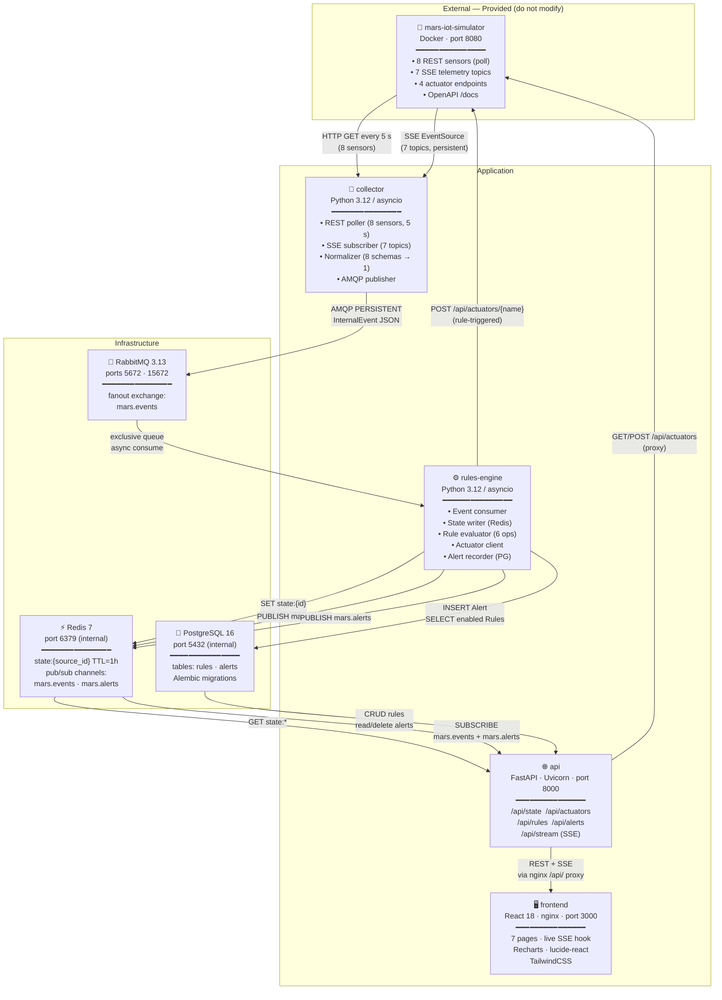
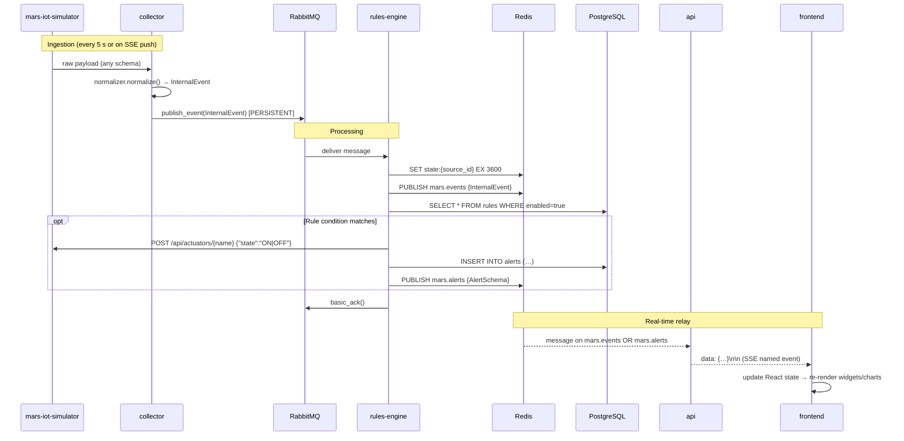

# Mars Operations — Architecture

## 1. System Overview

Mars Operations is an **event-driven IoT automation platform** composed of 8 Docker containers. It ingests heterogeneous sensor data from the Mars base simulator, normalises it into a unified internal event schema, evaluates IF-THEN automation rules, and delivers a real-time monitoring dashboard to base operators.

---

## 2. Container Diagram (C4 Level 2)



---

## 3. Data Flow — Sensor Reading → Dashboard Update



---

## 4. Internal Event Schema

All data flowing through the platform is normalised into a single `InternalEvent`:

```json
{
  "event_id":    "550e8400-e29b-41d4-a716-446655440000",
  "timestamp":   "2026-03-06T12:00:00.000Z",
  "source_id":   "greenhouse_temperature",
  "source_type": "rest_sensor | telemetry_topic",
  "category":    "environment | power | life_support | airlock | thermal",
  "metrics": [
    { "name": "value", "value": 22.5, "unit": "degC" }
  ],
  "status":      "ok | warning | null",
  "raw_schema":  "rest.scalar.v1",
  "extra_fields": {}
}
```

Source schemas handled by the normalizer:

| Raw Schema | Simulator Source | Mapped to |
|---|---|---|
| `rest.scalar.v1` | greenhouse_temperature, entrance_humidity, co2_hall, corridor_pressure | single `value` metric |
| `rest.chemistry.v1` | hydroponic_ph, air_quality_voc | `value` metric |
| `rest.level.v1` | water_tank_level | `level_pct` metric |
| `rest.particulate.v1` | air_quality_pm25 | `pm25_ug_m3` metric |
| `topic.power.v1` | solar_array, power_bus, power_consumption | `power_kw` + `voltage_v` + `current_a` + `cumulative_kwh` |
| `topic.environment.v1` | radiation, life_support | `measurements[]` pass-through |
| `topic.thermal_loop.v1` | thermal_loop | `temperature_c` + `flow_rate_lpm` |
| `topic.airlock.v1` | airlock | `last_state` + `cycles_per_hour` |

---

## 5. Automation Rule Model

```json
{
  "id":      "uuid",
  "name":    "High Greenhouse Temp → Cooling Fan ON",
  "enabled": true,
  "condition": {
    "source_id": "greenhouse_temperature",
    "metric":    "value",
    "operator":  "gt",
    "threshold": 35.0
  },
  "action": {
    "actuator_name": "cooling_fan",
    "state":         "ON"
  },
  "created_at": "2026-03-06T12:00:00Z",
  "updated_at": "2026-03-06T12:00:00Z"
}
```

Supported operators: `gt` (>), `lt` (<), `gte` (≥), `lte` (≤), `eq` (=), `neq` (≠).

---

## 6. Database Schema

### PostgreSQL (rules-engine + api)

**`rules`**

| Column | Type | Constraints |
|---|---|---|
| id | UUID | PK |
| name | TEXT | NOT NULL |
| enabled | BOOLEAN | NOT NULL, DEFAULT true |
| condition | JSONB | NOT NULL |
| action | JSONB | NOT NULL |
| created_at | TIMESTAMPTZ | NOT NULL |
| updated_at | TIMESTAMPTZ | NOT NULL |

**`alerts`**

| Column | Type | Constraints |
|---|---|---|
| id | UUID | PK |
| rule_id | UUID | FK → rules.id |
| rule_name | TEXT | NOT NULL |
| triggered_event | JSONB | NOT NULL |
| triggered_at | TIMESTAMPTZ | NOT NULL |

### Redis (rules-engine + api)

| Key pattern | Type | Value | TTL |
|---|---|---|---|
| `state:{source_id}` | String | InternalEvent JSON | 3600 s |

**Pub/Sub channels:** `mars.events` (sensor updates), `mars.alerts` (rule triggers)

---

## 7. API Endpoint Reference

| Method | Path | Description |
|---|---|---|
| GET | /api/health | Health check |
| GET | /api/state/ | All latest sensor states |
| GET | /api/state/{source_id} | Single sensor state |
| GET | /api/actuators/ | List all actuators + states |
| POST | /api/actuators/{name} | Set actuator state |
| GET | /api/rules | List all rules |
| POST | /api/rules | Create rule |
| GET | /api/rules/{id} | Get rule |
| PUT | /api/rules/{id} | Full update |
| PATCH | /api/rules/{id} | Set enabled |
| PATCH | /api/rules/{id}/toggle | Flip enabled |
| DELETE | /api/rules/{id} | Delete rule |
| GET | /api/alerts | Paginated alerts (filters: rule_id, source_id, limit, offset) |
| GET | /api/alerts/{id} | Get alert |
| DELETE | /api/alerts/{id} | Delete alert |
| GET | /api/stream | SSE: sensor_update + alert events |
| GET | /api/stream/events | SSE: sensor_update events only |
| GET | /api/stream/alerts | SSE: alert events only |

---

## 8. Docker Compose Service Graph

```
                    ┌─────────────────────┐
                    │  mars-iot-simulator  │ ← provided OCI image
                    │       :8080         │
                    └──────┬──────┬───────┘
                    poll/  │      │  actuator
                    SSE    │      │  POST
              ┌────────────┘      └──────────────┐
              ▼                                  ▼
       ┌─────────────┐                   ┌─────────────┐
       │  collector  │                   │     api     │
       │  (worker)   │──AMQP──► RabbitMQ │   :8000     │◄── nginx proxy ◄── frontend :3000
       └─────────────┘          │        └──┬──┬───────┘
                                │ consume   │  │
                                ▼           │  │
                        ┌──────────────┐   │  │
                        │ rules-engine │   │  │
                        │  (worker)    │   │  │
                        └──┬──┬──┬────┘   │  │
                           │  │  │        │  │
                    Redis ◄─┘  │  └──►PG  │  │
                      │        └──►SIM    │  │
                      └───────────────────┘  │
                      pub/sub relay          │
                                   PG ───────┘
                                   CRUD rules/alerts
```

---

## 9. Technology Stack Summary

| Layer | Technology | Version |
|---|---|---|
| Collector | Python + asyncio + httpx + aio-pika + pydantic v2 | 3.12 |
| Rules Engine | Python + asyncio + aio-pika + SQLAlchemy + asyncpg + redis + alembic + httpx | 3.12 |
| API | FastAPI + Uvicorn + SQLAlchemy + asyncpg + redis + sse-starlette | 3.12 |
| Message Broker | RabbitMQ | 3.13-management |
| State Cache | Redis | 7-alpine |
| Database | PostgreSQL | 16-alpine |
| Frontend | React 18 + TypeScript + Vite + TailwindCSS + Recharts + lucide-react + react-router-dom v6 | — |
| Serving | nginx | stable-alpine |
| Containerisation | Docker + Docker Compose | — |
